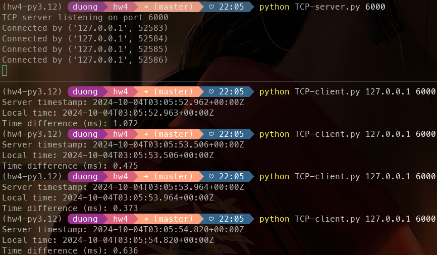
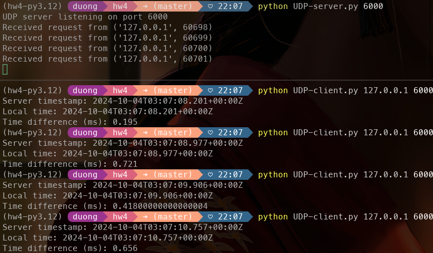
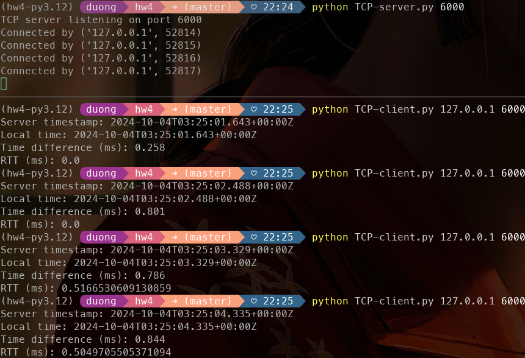
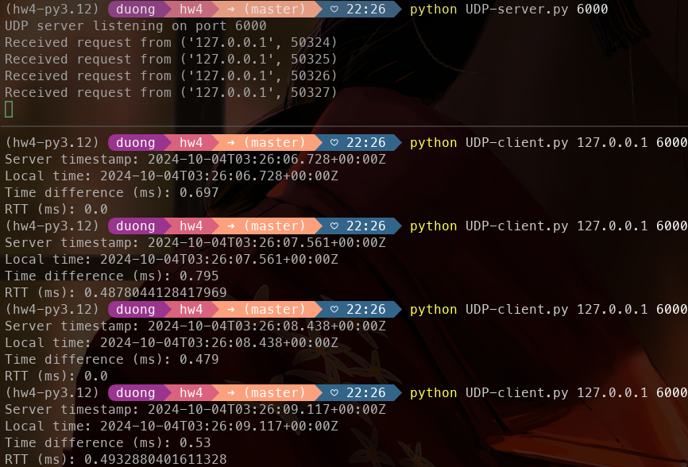

(a)
---
N/A

(b)
---
TCP server and client

UDP server and client

(c)
---
UDP is typically faster on average than TCP. This agrees with the knowledge that UDP is a simpler
protocol with smaller header and less handshakes than TCP.

(d)
---
TCP server and client (modified w/ RTT)

UDP server and client (modified w/ RTT)

Due to running the client and server on the same machine the RTT is very small. Without
also modifying the server it is hard to determine the client-to-server and server-to-client delay
respectively, since we can only know the overall RTT time. 

But in general we should not expect these delays to be the same, since depending on how long 
it takes the server to respond, the original path could have gotten more or less congested. IE. packets may have taken different
paths to get to the server than the path used to send back, either increasing or decreasing
the server-to-client delay slightly. 

We shouldn't expect the variance to extraordinarily large,
unless there is something causing huge network assymetry (ie. more packets sent by server than client or vice/versa, or
unequal network up/down speeds).

(e)
---
When I run the udp/tcp servers on physically distant machines there is generally a small observable
increase in delay. I notice a relative greater delay when using the machines during congested times of day (ie. during business hours or noon),
has a greater impact on delay than when running at say midnight (relative is only 2-5 ms more than physical distance
delay).

The obvious explanation for physically distant machines is obviously that there may be a longer network
path the packets have to take (but it's not necessarily true that physically distant servers correlate directly with
longer network path, maybe some physically distant networks have high-speed connections between them).

The explanation for packets taking longer during more or less congested times of day is due to network availibility/
network sharing. As many users access the same network, the most optimal path may already be utilized by another user,
so a less than ideal path may have to be utilized to send packets. That or the packets simply have to wait in the network.